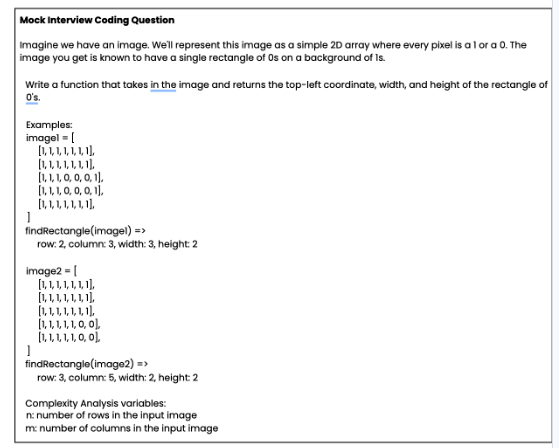

# Rectangle Detector

Finds all solid white rectangles in a binary bitmap (`0` = white, `1` = black).



## Questions and Answers
* I’m interested in what they thought of it (was it easy?)

Like many problems it is both easy and difficult at the same time, depending on the detailed acceptance criteria and architectural constraints at play. 
There was no one to ask about requirements so I made some assumptions. These functional assumptions are encapsulated in the tests. 
Performance constraints, memory constraints and the size of the bitmap, also the sparsity or density of the rectangles were not indicated.
Given this, the most performant implementation strategy would be a guess at best. The simplest strategy of course is a raster scan. I did
some research and found out that there were also other alternative strategies that might be more performant under certain circumstances.
I decided to come up with a solution that supported multiple strategies and to benchmark each.

* Can they explain their logic?

The logic of the raster scan is relatively straight forward. Traverse left to right, top to bottom through the bitmap looking for a top left pixel of a white shape.
Once found then test whether that is the start of a rectangle. Keep scanning and collecting rectangles as you go. The other strategies are described below.

* If someone else is working through it, what types of prompting would they use to be helpful without giving away the core answers?

I would suggest they begin with a simple raster scan with two nested for loops traversing the width (x) and the height (y) of the bitmap one pixel at a time.
Depending on the pixel we are on we have found the top left of a rectangle, are inside a rectangle or are still searching...
My advice would be to get this to work with the help of the tests, checking for boundary conditions. Once working then look to refactor. I chose to refactor and replace
the nested loops by treating the bitmap as a stream. A neater and more readable functional solution, which didn't come to mind initially.

## Architecture

Detection is pluggable via a single interface:

```java
public interface SearchStrategy {
    List<Rectangle> detect(int[][] bitmap);
}
```

Use any strategy with `RectangleDetector`:

```java
List<Rectangle> rects = new RectangleDetector(new RasterStrategy()).detect(bitmap);
List<Rectangle> rects = new RectangleDetector(new HistogramStrategy()).detect(bitmap);
List<Rectangle> rects = new RectangleDetector(new ParallelRasterStrategy(8)).detect(bitmap);
```

---

## Strategies

### `RasterStrategy`

**Algorithm.** Scans left-to-right, top-to-bottom. At each white pixel that has black (or a boundary) above and to the left — a top-left corner — it scans right for the width, down for the height, then verifies the entire candidate area is solid white.

**Complexity.**
- Time: O(rows × cols + Σ w·h) per rectangle found
- Space: O(1) auxiliary

**Best for.** Sparse bitmaps (few white pixels, small total rectangle area) and small inputs. Overhead is proportional to white area, not total bitmap size.

---

### `HistogramStrategy`

**Algorithm.** Precomputes two auxiliary arrays across the full bitmap before scanning:
- `runRight[y][x]` — consecutive white pixels rightward from `(x, y)` in row `y`
- `runDown[y][x]` — consecutive white pixels downward from `(x, y)` in column `x`

Both are built in a single O(rows × cols) pass. The raster scan then uses these lookups at each top-left corner to read width and height directly, replacing the inner column loop in solid-rectangle verification with a row-by-row `runRight` check.

**Complexity.**
- Time: O(rows × cols) preprocessing + O(rows × cols + Σ h) detection
- Space: O(rows × cols) for two aux arrays

**Best for.** Theoretically benefits bitmaps with many large rectangles where the O(w·h) verification in `RasterStrategy` dominates. In practice (see benchmarks), the preprocessing cost currently exceeds the savings for typical inputs.

**Why it is currently slow.** The bottleneck is in `detect`: to confirm a rectangle of height `h`, the code still checks `runRight[row][x] >= width` for every row from `y` to `y+h`. That is still O(h) per rectangle — the preprocessing saved the O(w) column scan but not the O(h) row scan. For bitmaps with many small rectangles the preprocessing cost dominates without enough savings to compensate.

**How to fix it — range-min queries.**
The row check is really asking: *"what is the smallest `runRight` value in this column between rows `y` and `y+h`?"* Currently we find that by looping. A smarter pre-built index — called a [Sparse Table](https://en.wikipedia.org/wiki/Range_minimum_query) — can answer the same question in a single step regardless of how tall the rectangle is, after a one-time build. Think of it like a database index: building it costs time up front, but individual lookups become instant. With this in place, rectangle verification drops from proportional-to-height to constant time, which is where the strategy would start to pull ahead of `RasterStrategy` for tall rectangles.

**How to fix it — SIMD.**
[SIMD](https://en.wikipedia.org/wiki/Single_instruction,_multiple_data) (Single Instruction Multiple Data) is a CPU feature that processes several values at once rather than one at a time. Think of it like counting a pile of coins: you could count them one by one, or grab a handful and weigh them all at once. The bitmap-scanning loops in `buildRunRight` and `buildRunDown` currently read one pixel per step; SIMD would let them read 8–32 pixels per step using the same number of CPU cycles. In Java this is available via the [Vector API](https://openjdk.org/jeps/469) (standard from JDK 23).

The two fixes are complementary: the Sparse Table eliminates the loop entirely; SIMD speeds it up if the loop is kept.

---

### `ParallelRasterStrategy(int threads)`

**Algorithm.** Divides the bitmap into horizontal row bands — one per thread. Each thread independently runs `RasterStrategy` logic on its assigned rows using the full bitmap for scanning and verification. Because a rectangle is uniquely identified by its top-left corner, and each top-left corner belongs to exactly one band, there is no double-counting and no inter-thread coordination during detection. Results from all threads are merged and sorted by `(y, x)` to preserve raster order.

**Complexity.**
- Time: O(rows × cols / threads) wall-clock, plus merge sort
- Space: O(R) for merged results, where R = rectangles found

**Best for.** Medium-to-large bitmaps on multi-core hardware. The thread pool is created once in the constructor and reused across calls, so per-call overhead is limited to task submission and result merging. Crossover against `RasterStrategy` is around 500×500 dense; gains are substantial at 2000×2000 and above.

---

## Running the tests

Requires Java 17 and Maven.

```bash
mvn test
```

Three test classes run:

| Class | What it tests |
|---|---|
| `AllStrategiesTest` | Four correctness cases run against all three strategies (12 parameterised cases) |
| `StrategyPerformanceTest` | Timing comparison across six bitmap scenarios; asserts all strategies agree on results |

---

## Benchmark results

Run on a MacBook (Apple Silicon), JDK 17, 5 warmup + 20 measured iterations per cell.
`ParallelRasterStrategy` pool is created once in the constructor and reused across all calls.

```
small-sparse  50×50
  strategy         mean(ms) stddev(ms)    rects
  Raster              0.031      0.002        3
  Histogram           0.088      0.008        3
  Parallel-2          0.048      0.007        3
  Parallel-8          0.080      0.025        3

small-dense   50×50
  strategy         mean(ms) stddev(ms)    rects
  Raster              0.026      0.004      100
  Histogram           0.041      0.009      100
  Parallel-2          0.064      0.010      100
  Parallel-8          0.069      0.010      100

medium-sparse 500×500
  strategy         mean(ms) stddev(ms)    rects
  Raster              0.356      0.122       20
  Histogram           1.219      0.100       20
  Parallel-2          0.495      0.065       20
  Parallel-8          0.408      0.127       20

medium-dense  500×500
  strategy         mean(ms) stddev(ms)    rects
  Raster              0.888      0.058     3025
  Histogram           2.210      1.315     3025
  Parallel-2          0.494      0.034     3025
  Parallel-8          0.301      0.031     3025

large-sparse  2000×2000
  strategy         mean(ms) stddev(ms)    rects
  Raster             10.114      0.400       50
  Histogram          22.106      2.800       50
  Parallel-2          5.246      0.328       50
  Parallel-8          1.894      0.503       50

large-dense   2000×2000
  strategy         mean(ms) stddev(ms)    rects
  Raster             13.088      0.264    13689
  Histogram          32.521      0.989    13689
  Parallel-2          6.405      0.183    13689
  Parallel-8          2.706      0.630    13689
```

### What the numbers tell us

**`RasterStrategy` is the single-threaded baseline to beat.** It is the fastest single-threaded option across every scenario. Its simplicity keeps constant factors low.

**`HistogramStrategy` is consistently slower, not faster.** The O(rows × cols) cost of building `runRight` and `runDown` — two full-bitmap passes and two extra arrays — exceeds what is saved during detection for the tested inputs. The strategy would only win if the solid-rectangle verification loop were the dominant cost, which requires very large rectangles relative to bitmap size. That scenario does not appear in these benchmarks.

**`ParallelRasterStrategy` crossover is lower than before.** Fixing the pool lifecycle (created once in the constructor, not per call) eliminated most of the small-bitmap overhead. `Parallel-8` at 50×50 dropped from 0.709 ms to 0.080 ms — an 8× improvement at that scale alone. The crossover against `RasterStrategy` now occurs around medium-dense (500×500), and gains are substantial at 2000×2000:

| Scenario | Raster | Parallel-2 | Parallel-8 |
|---|---|---|---|
| medium-dense 500×500 | 0.888 ms | 0.494 ms (1.8×) | 0.301 ms (3×) |
| large-sparse 2000×2000 | 10.1 ms | 5.2 ms (1.9×) | 1.9 ms (5.3×) |
| large-dense 2000×2000 | 13.1 ms | 6.4 ms (2×) | 2.7 ms (4.8×) |

Scaling is sub-linear at large size (4–5× with 8 threads rather than 8×), which is consistent with merge-and-sort overhead and memory bandwidth limits on a shared bitmap.

**Rule of thumb.**
- Bitmap < 500×500, or called infrequently → `RasterStrategy`
- Bitmap ≥ 500×500 dense, or ≥ 2000×2000, and ≥ 2 cores available → `ParallelRasterStrategy`
- `HistogramStrategy` as-is → not recommended; see strategy description above for two concrete paths to make it competitive (Sparse Table RMQ or SIMD via the Java Vector API)
